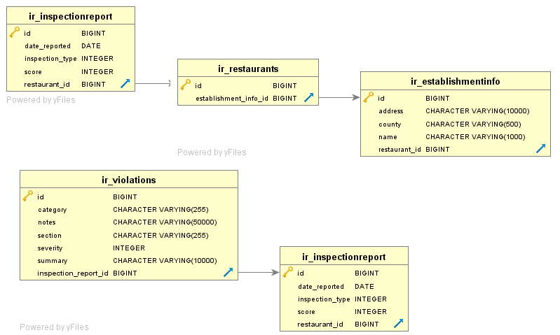

# Prerequisites

1. Docker
2. Postman (for easy api querying)

# Docker build instructions
1. To build, tag, and push, run ```gradlew buildAndTagImage --console=plain --stacktrace -PdockerImageVersion=YOUR_VERSION -PpathToRepos=/path/to/repos.json```. The `pathToRepos` property should be .json file containing a map of key:value pairs where the value is the remote repository name. You can create an empty json file containing an empty map i.e. `{}` to skip the remote tagging/pushing steps
2. To just build the image, run ```gradlew docker --console=plain --stacktrace -PdockerImageVersion=YOUR_VERSION```
3. Note: the --console and --stacktrace flags are for troubleshooting purposes
4. To manually build this image i.e. with the docker commands, this application takes in three build args. Here's a sample working command: ```gradlew clean build && docker build --build-arg JAR_FILE=build/libs/restaurantscores-server-0.0.1-SNAPSHOT.jar --build-arg PORT=8080 --build-arg HEROKU_EXEC_FILE=path/to/file.sh -t restaurantscores-server:YOUR_VERSION -f docker\restaurantscores-server\Dockerfile .```


# Docker run instructions

1. This application relies on environment variables for the app and the database to start.
2. You will need to provide the .env file paths in the docker-compose.yml file or modify the yaml file directly. For an overview of what environment variables are required, review [Requirements.txt](Requirements.txt) as a sample .env file.
3. postgres:latest db environment variable requirements:
    1. POSTGRES_DB=healthinspections
    2. POSTGRES_USER=postgres
    3. POSTGRES_PASSWORD=YOUR_PASSWORD
4. restaurant-scores:latest environment variable requirements:
    1. JDBC_DATABASE_URL -> the url to your postgres db. To use the dockerized postgresql container, update this environment var to look like ```JDBC_DATABASE_URL=jdbc:postgresql://restaurantscores-db:5432/healthinspections```.
    2. JDBC_DATABASE_USERNAME and JDBC_DATABASE_PASSWORD should be db username and password. Note: POSTGRES_PASSWORD needs to match JDBC_DATABASE_PASSWORD.
    3. RELATIVE_PATH_TO_PAGE_STORAGE needs to be a relative path that ends in a slash
    4. APP_DATA_FOLDER needs to be a fully qualified path that does not end in a slash. The two are concatenated in [firebase data](src/main/java/com/janeullah/healthinspectionrecords/domain/PathVariables.java)
5. In the docker-compose.yml file, update the restaurantscores-server.image setting to point to your local or remote image e.g. `restaurantscores-server:YOUR_VERSION`.
6. At the root of the project, open a Terminal tab and type `cd docker`. Then, type `docker-compose up` to start the containers.

# Health Checks

1. Type `docker ps` at your terminal and you should see the restaurantscores-server app is UP.
2. Alternately, ping `http://localhost:8080/restaurantscores/actuator/health` and you should get a 200 http status code response back and status with a value of 'UP'

# What is this application

1. This is a web service that can perform the following actions
    1. fetches 10 webpages from http://publichealthathens.com/wp/programs/restaurantinspections/
    2. processes the downloaded files and stores the data into the postgresql database. The database model is referenced below: 
    3. offers apis to query the processed data (review the exposed endpoints in the *Controller.java classes and select *ControllerTest.java classes
2. Optionally, there are endpoints to push the data in the postgresql datastore to Firebase and Heroku Bonsai. These rely on *your* own Google|Heroku api keys/secrets.
    1. The data is transformed for storage into Firebase. Sample of the generated data: [firebase data](src/main/resources/firebase-schema.json). This data powers a separate project of mine (shameless plug - [NorthEast Georgia Health Inspection Records Android app](http://bit.ly/negarestauranthealthinspections) )
    2. The Heroku push requires the Bonsai addon and the creation of a `restaurants` index. This is used to power searching for the aforementioned Android app.

# Additional Notes

1. The postgresql database is accessible at port 5433. If using pgAdmin to connect to the database, you'll get a series of alarming alerts because the admin pack extension is not installed. You can still browse the database once you get past the alerts.
2. This application runs on post 8080 (see [docker-compose.yml](docker/docker-compose.yml) to change this setting.
3. The context of this application is `/restaurantscores` and the active spring profile is `postgresql`

# In case of problems running the app

1. Please create a github issue with detailed logs and steps to reproduce.

[](https://circleci.com/gh/janoulle/NEGARestaurantScores/tree/master)